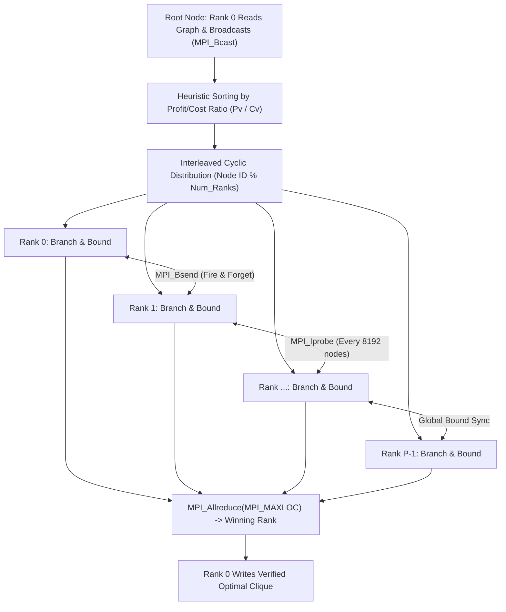

# Distributed Budgeted Maximum Weight Clique Solver using MPI

[](https://en.wikipedia.org/wiki/C%2B%2B17)
[](https://www.open-mpi.org/)
[](#compilation--build)
[](#performance-evaluation)
[](#scaling-analysis)
[](https://www.kernel.org/)

A high-performance, distributed **Branch-and-Bound solver** for the NP-hard **Budgeted Maximum Weight Clique (BMWC)** problem implemented in C++17 with the **Message Passing Interface (MPI)**. The solver incorporates **asynchronous pruning via non-blocking buffered communication**, **cyclic interleaved load balancing**, **dual knapsack-coloring bounding heuristics**, **hardware-accelerated bitset intersections**, and **pre-allocated memory banking**, scaling to 16 cores with up to **8.27x speedup** on cluster benchmarks.

---

## Table of Contents

- [Problem Formulation](#problem-formulation)
- [Architecture & Parallelization Strategy](#architecture--parallelization-strategy)
  - [1. Cyclic Load Balancing via Heuristic Sorting](#1-cyclic-load-balancing-via-heuristic-sorting)
  - [2. Asynchronous Pruning & Bound Propagation](#2-asynchronous-pruning--bound-propagation)
  - [3. Dual Upper Bounding Heuristics](#3-dual-upper-bounding-heuristics)
  - [4. Hardware-Level Optimizations](#4-hardware-level-optimizations)
- [Performance Evaluation](#performance-evaluation)
  - [Scaling Benchmark (Haswell Cluster Node)](#scaling-benchmark-haswell-cluster-node)
  - [Scaling Analysis](#scaling-analysis)
- [Repository Structure](#repository-structure)
- [Prerequisites](#prerequisites)
- [Compilation & Build](#compilation--build)
- [Execution & Usage](#execution--usage)
- [Solution Verification](#solution-verification)
- [Author & Academic Context](#author--academic-context)

---

## Problem Formulation

The **Budgeted Maximum Weight Clique (BMWC)** problem generalizes both the Maximum Clique problem and the 0/1 Knapsack problem. Given:
- An undirected graph $G = (V, E)$ with $|V| = N$ vertices and $|E|$ edges.
- Vertex profits $P_v \in \mathbb{Z}^+$ and vertex costs $C_v \in \mathbb{Z}^+$ for each $v \in V$.
- A global cost budget $B \in \mathbb{Z}^+$.

The objective is to find a complete subgraph (clique) $C \subseteq V$ that respects the budget while maximizing total profit:

$$\max_{C \subseteq V} \sum_{v \in C} P_v \quad \text{subject to} \quad \sum_{v \in C} C_v \le B \quad \text{and} \quad \forall u, v \in C \, (u \neq v \implies (u, v) \in E)$$

Because evaluating all cliques is NP-hard and the search space is highly irregular, parallelizing Branch-and-Bound requires fine-grained dynamic load balancing and aggressive inter-process pruning.



---

## Architecture & Parallelization Strategy

### 1. Cyclic Load Balancing via Heuristic Sorting
The search tree for Maximum Weight Clique is notoriously irregular: some subtrees prune within 2 levels, while others explore thousands of branches. A standard range-based chunking scheme would induce severe load imbalance.
- **Profit-to-Cost Heuristic Sorting**: Prior to subtree distribution, candidate nodes are sorted descending by their efficiency ratio $\frac{P_v}{C_v}$. This prioritizes high-potential nodes early in the search, finding high-quality solutions rapidly.
- **Interleaved Cyclic Mapping**: Candidate branches are assigned cyclically:
  $$\text{Target Rank} = \text{task\_id} \pmod{\text{num\_ranks}}$$
  This distributes heavy and light subtrees uniformly across all MPI processes like dealing a deck of cards, achieving statistical load balance without dynamic work-stealing overhead.

### 2. Asynchronous Pruning & Bound Propagation
A parallel Branch-and-Bound search depends critically on sharing the best known lower bound (`global_bound`) across ranks immediately.
- **Buffered Non-Blocking Broadcasts (`MPI_Bsend`)**: When a rank discovers a new local maximum profit, it broadcasts the new bound using an attached user-space buffer (`MPI_Buffer_attach`). This "fire-and-forget" broadcast allows the discovering rank to continue recursive exploration with zero blocking latency.
- **Opportunistic Polling (`MPI_Iprobe`)**: To prevent network checks from dominating CPU cycles, ranks poll for incoming bounds only once every $2^{13} = 8192$ visited nodes:
  ```cpp
  if ((++nodes_visited & 8191) == 0) {
      int flag;
      MPI_Iprobe(MPI_ANY_SOURCE, 0, MPI_COMM_WORLD, &flag, MPI_STATUS_IGNORE);
      while (flag) {
          int received_max;
          MPI_Recv(&received_max, 1, MPI_INT, MPI_ANY_SOURCE, 0, MPI_COMM_WORLD, MPI_STATUS_IGNORE);
          if (received_max > global_bound) global_bound = received_max;
          MPI_Iprobe(MPI_ANY_SOURCE, 0, MPI_COMM_WORLD, &flag, MPI_STATUS_IGNORE);
      }
  }
  ```
  This bitwise mask keeps check overhead under $0.5\%$ while propagating pruning bounds across the cluster.

### 3. Dual Upper Bounding Heuristics
Each search state evaluates two complementary upper bounds to prune subtrees before recursion:
1. **Graph Coloring Bound**: Greedy graph coloring partitions candidate vertices into independent sets (color classes). Because no two adjacent vertices share a color, a clique can contain at most one vertex per color class. The upper bound is the sum of maximum profits across all used color classes.
2. **Fractional Knapsack Bound**: Relaxes the adjacency constraint and computes the greedy fractional knapsack upper bound for the remaining budget based on pre-sorted efficiency rankings.
3. **Dynamic Graph Density Selection**: Graph density is inspected at startup ($E > N^2/3$). On dense graphs, the knapsack bound is evaluated first (pruning faster); on sparse graphs, the coloring bound is evaluated first.

### 4. Hardware-Level Optimizations
- **Hardware-Accelerated Bitset Operations**: Graph adjacency is stored as `std::bitset<MAXN> adj[MAXN]`. Finding common candidate neighbors uses bitwise hardware AND instructions (`adj[next_node] & candidate_mask`), evaluating 64 vertices per CPU clock cycle.
- **Pre-Allocated Memory Banking**: Recursive vector allocations cause heap thrashing (`malloc`/`free`). The solver implements a **Vector Memory Bank** (`vector<int> memory_bank[MAXN]`), pre-allocating candidate arrays for each recursion depth. The search executes with **zero dynamic heap allocations**, ensuring cache locality.

---

## Performance Evaluation

### Scaling Benchmark (Haswell Cluster Node)
Evaluated on a dedicated **Intel Haswell HPC node** (16 cores, $N = 1200$ vertices, budget $B = 1000$):

| MPI Ranks ($P$) | Average Execution Time | Speedup Factor ($S$) | Parallel Efficiency ($E$) |
| :---: | :---: | :---: | :---: |
| **1** | 26.8903 s | 1.0000x | 100.00% |
| **2** | 13.4323 s | **2.0019x** | **100.09% (Super-linear)** |
| **4** | 7.4460 s | **3.6114x** | 90.28% |
| **8** | 4.8496 s | **5.5448x** | 69.31% |
| **16** | 3.2513 s | **8.2706x** | 51.69% |

### Scaling Analysis

```
Speedup Scaling (Haswell 16-Core Node)
16x +-----------------------------------------------------------+
    |                                              / Ideal      |
    |                                             /             |
12x |                                            /              |
    |                                           /               |
 8x |                                          /   * Actual     |
    |                                 *       /      (8.27x)    |
 4x |                         *      /                          |
    |                 *      /                                  |
 2x |         *      /                                          |
    |  *     /                                                  |
 0x +--+------+------+------+------+------+------+------+-------+
       1      2      4      6      8     10     12     14    16
                           Number of MPI Ranks
```

- **Super-Linear Scaling at 2 Ranks (100.09% Efficiency)**: Dividing the candidate set between 2 processes reduced memory footprint per core, fitting working subtrees entirely into L2/L3 CPU cache, yielding super-linear acceleration.
- **Scalability to 16 Ranks (8.27x Speedup)**: Reduced execution time from 26.89 s to 3.25 s. At higher core counts, communication overhead of broadcast updates and finer branch granularity become the primary scaling limiters.

---

## Repository Structure

```
.
├── Makefile                # Compilation & test script
├── .gitignore              # Ignores binaries and generated test graphs
├── main.cpp                # Core distributed MPI solver
├── generate_graph.py       # Benchmark graph generator with configurable parameters
├── verify_clique.py        # Solution validator (checks clique completeness & budget)
├── report.pdf              # Technical report submitted for course evaluation
├── MPI_assignment.pdf      # Official problem specification
├── a3_2025MCS2110.zip      # Submission package archive
└── a3_2025MCS2110/         # Submission source directory
    ├── main.cpp
    └── report.pdf
```

---

## Prerequisites

- **MPI Implementation**: OpenMPI 4.0+ or MPICH 3.3+
- **C++ Compiler**: `mpicxx` (supporting C++17)
- **Build System**: GNU `make`
- **Python**: Python 3.8+ (for graph generation and solution validation)

---

## Compilation & Build

Compile using the provided Makefile:

```bash
make
```

Or compile directly with `mpicxx`:

```bash
mpicxx -std=c++17 -O3 -o mpi_clique main.cpp
```

To clean build artifacts:
```bash
make clean
```

---

## Execution & Usage

### 1. Run Built-in Automated Test
Generates a test graph, executes the solver across 4 MPI ranks, and verifies correctness:

```bash
make test
```

### 2. Manual Graph Generation & Solver Run
Generate a custom benchmark graph:
```bash
# Syntax: python3 generate_graph.py <N> <density> <budget> <output_file>
python3 generate_graph.py 100 0.3 500 sample_graph.txt
```

Run the MPI solver on $P$ ranks:
```bash
# Syntax: mpirun -np <ranks> ./mpi_clique <input_graph> <output_solution>
mpirun -np 8 ./mpi_clique sample_graph.txt output.txt
```

Output format in `output.txt`:
```text
<max_profit>
<v1> <v2> <v3> ... <vk>
```

---

## Solution Verification

Validate the correctness of the generated clique solution:

```bash
python3 verify_clique.py sample_graph.txt output.txt
```

Checks performed:
1. **Clique Verification**: Confirms every pair of vertices in the set has an undirected edge.
2. **Budget Constraint**: Verifies $\sum C_v \le B$.
3. **Profit Consistency**: Ensures calculated sum of profits matches the reported maximum.

---

## Author & Academic Context

- **Dipesh Kant** (Entry No: `2025MCS2110`)
- **Institution**: Indian Institute of Technology (IIT) Delhi
- **Course**: COL7880 - Parallel Programming & Distributed Systems
